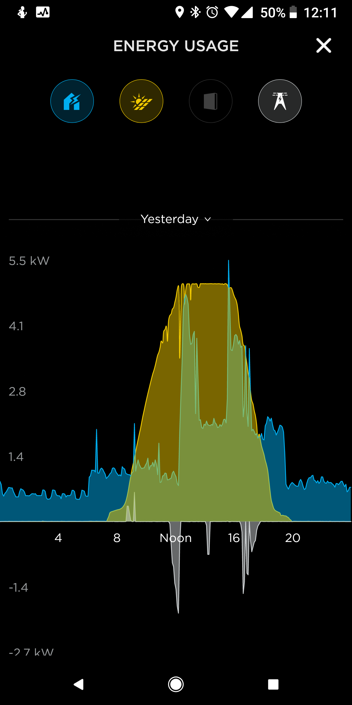

I graphed and cloud enabled my solar production and consumption metrics using the SolarEdge API, Azure Automation, Powershell, Azure SQL Database and Microsoft PowerBI, to detect faults with my equipment and predict my power bills.

## Contents

- [Introduction](#introduction)
- [My solar setup](#my-solar-setup)
- [Finding a fault](#finding-a-fault)
- [Visualizing the data](#visualizing-the-data)
- [Kicking it up a gear](#kicking-it-up-a-gear)
- [The end result](#the-end-result)
- [Conclusion](#conclusion)

# Introduction

Early last year I had solar generation system installed at my home. When it was installed, I had a sneaking suspicion that it wasn't working properly. For a 6.36 kW system, in perfect conditions it was only generating 1-2 kW/hr. I called the solar installation company, but their diagnostics did not show any faults with my installation.

What I needed was some hard factual data that either proved or disproved there was a fault with the product. I did some googling, and found that my inverter had an API I could access. I knew it it would provide me the gateway to get exactly what I needed.

Using the API, I graphed the generation, consumption and import statistics of my system. I then found the average generation statistics a system my size *should* be generating, and compared the two data-sets. The data demonstrated a problem with my system that my solar company couldn't refute. 

Over the course of several weeks, they sent out several electricians. Eventually they applied a firmware update to the inverter, and the generation stats are now much closer to expected averages. 

With the main problem finally resolved, I came to realize that I had access to all this interesting power generation data from my inverter. I started to think about ways I could use this data to tell interesting stories about my solar system, and power usage habits. 

Using this data, I created PowerBI graphs that show me:
- How the solar system is currently performing
- How the solar generation effects the cost of my electricity bills
- A filterable history that allows me to identify trends
- Forecasted costs of my energy bills

# <a name="my-solar-setup"></a>My solar setup

My Solar equipment is as follows:
- 24 x 265w Q-Cell solar panels (6.36kW/hr in total)
- 1 x SolarEdge 5kW RWS inverter
- 1 x Telsa PowerWall 2 (14kW) battery

The key component of this system is SolarEdge inverter. Every watt of power that passes in and out of my home goes through it. It acts as the middle man for everything, and is the source of truth when it comes to my house generating or consuming power from all sources. The inverter sends this data back to SolarEdge and makes it available for customers on their website.

# <a name="finding-a-fault"></a>Finding a fault

Circling back around to the problem that started me on this path, I knew that to find fault with my solar system, I first needed to see what it was doing. From there, I can compare it against what i'm expecting it to do.

## SolarEdge API

### Authenticating 

I followed the [API documentation](https://www.solaredge.com/sites/default/files/se_monitoring_api.pdf) and generated an API key. The process was pretty simple. I just logged in with the same credentials I configured for the mobile app, and genrated a new key.


### Getting useful information
I read the documentation looking for any relevant functions. I found what I was looking for in the *Site Energy - Detailed* function.

The next thing to do was fire up [Postman](https://www.getpostman.com/) and construct an API call to give it a test.
In this example I wanted to pull back the total wH produced from my panels for 01 DEC 2017, so i used the following parameter values

| Parameter | Value               |
| --------- | ------------------- |
| meters    | PRODUCTION          |
| timeUnit  | DAY                 |
| startTime | 2017-12-01 00:00:00 |
| endTime   | 2017-12-01 23:59:59 |

```
https://monitoringapi.solaredge.com/site/{{siteid}}/energyDetails?meters=PRODUCTION&timeUnit=DAY&startTime=2017-12-01%2000:00:00&endTime=2017-12-01%2023:59:59&api_key={{apikey}}
```

And the results:
```json
{
    "energyDetails": {
        "timeUnit": "DAY",
        "unit": "Wh",
        "meters": [
            {
                "type": "Production",
                "values": [
                    {
                        "date": "2017-12-01 00:00:00",
                        "value": 16004
                    }
                ]
            }
        ]
    }
}
```

Success! 

## Creating the database

In order for me to to use this data for analysis, i'm want as much info as I can get - the more granular the better. The SolarEdge API supports a time interval of 15 minutes, but there's some API restrictions that I needed to work around. For example, the API restricts you to a maximum of 300 calls per day, and it limits you to of one month's worth of data when using a time interval <= an hour. That means that I couldn't retrieve an entire year's worth of data in 15 minute increments in a single API call. I'd need to make 12 separate calls at a minimum.

I figured the best way to deal with those limitations would be to store all the data in a database so I can query it as much as I wanted without contributing to the API limits. I ended up writing two scripts:
1. A once-off script to seed the database with historical data
2. A script I would schedule to run every day to get the data for the previous day and keep the database up to date.

I deployed an Azure SQL Database using an ARM template and I was ready to go.
```json
< ... snip ..>
{
    "comments": "Deploy the SQL Server",
    "apiVersion": "2014-04-01-preview",
    "name": "[parameters('sqlserverName')]",
    "type": "Microsoft.Sql/servers",
    "location": "[resourceGroup().location]",
    "properties": {
        "administratorLogin": "[parameters('sqlserverAdminUsername')]",
        "administratorLoginPassword": "[parameters('sqlserverAdminPassword')]"
    },
    "tags": {
        "project": "SolarEdge"
    },
    "resources": [
        {
            "comments": "Deploy the SQL Database",
            "apiVersion": "2014-04-01-preview",
            "type": "databases",
            "name": "[parameters('databaseName')]",
            "location": "[resourceGroup().location]",
            "dependsOn": [
                "[concat('Microsoft.Sql/servers/', parameters('sqlserverName'))]"
            ],
            "properties": {
                "collation": "SQL_Latin1_General_CP1_CI_AS",
                "edition": "Basic",
                "maxSizeBytes": "1073741824",
                "requestedServiceObjectiveName": "Basic"
            }
        },
        {
            "comments": "Create the external access firewall rule",
            "condition": "[greater(length(parameters('publicIPAddress')),1)]",
            "apiVersion": "2014-04-01-preview",
            "name": "AllowExternalAccess",
            "type": "firewallrules",
            "location": "[resourceGroup().location]",
            "dependsOn": [
                "[resourceId('Microsoft.Sql/servers', parameters('sqlserverName'))]"
            ],
            "properties": {
                "startIpAddress": "[parameters('publicIPAddress')]",
                "endIpAddress": "[parameters('publicIpAddress')]"
            }
        }
    ]
}
< .. snip .. >
```

Next I needed to create a database schema for storing the API data. Looking at the output from the API, it returns two values. The  timestamp of the reading, and the value in Wh. I created a table called `ProductionHistory` with two columns.

```SQL
USE SolarEdge;
CREATE TABLE dbo.ProductionHistory
(
    date SMALLDATETIME NOT NULL PRIMARY KEY,
    kWh decimal(10,2)
);
```
I decided to store the readings in kWh instead of Wh, and would do the conversion when I add the row to the table.

### Seeding the database

Next I needed to seed the database with all the historical data. Since there's a daily limit on API calls, I wanted to pull as much information with as few calls as possible. The largest timeframe I can get in a single API call for 15 minute intervals is 1 month - so as mentioned before, that means I can get a year's worth of historical data in 12 API calls. I can work with that.

Using powershell, I created a module to contain some common functions that I might need to call regularly.

First I created a class to define a meter reading to give it a little structure
```powershell
Class MeterReading {
    [DateTime]$Date
    [int]$Wh

    MeterReading([DateTime]$Date, [int]$Wh) {
        $this.Date = $Date
        $this.Wh = $Wh
    }
}
```

I then created a function that accepts `StartDate` and `EndDate` as parameters and spits out all the meter reading data between those two dates. Since the greatest timeframe exportable from the API is 1 month, I handled that in code by making an API call for each month between the dates entered in the parameters.

```powershell
## Define Variables

$siteID = '12345'
$apiKey = 'ABCDEFGHIJKLMNOPQRSTUVXYZ123456789=='

Function Get-EnergyDetailHistory {
    # Get the energy details on a per-month bassis.
    param (
        [Parameter(Mandatory = $True)]
        [DateTime]$StartDate,
        [DateTime]$EndDate = [DateTime]::Today.AddSeconds(-1) # Default: Midnight Yesterday 
    )

    # If the end date is in a different year - exit.
    If ($StartDate.Year -ne $EndDate.Year) {
        Throw "Start Date and End Date cannot span multiple years."
    }
    
    # If the end date is in the future
    # Get everything up to yesterday
    If ($EndDate -gt (Get-Date)) {
        $EndDate = [DateTime]::Today.AddSeconds(-1) # Midnight Yesterday
    }

    # API only supports max of 1 month results for this level of granularity
    # Loop through each month
    [MeterReading[]]$output

    $baseUrl = "/site/$($siteID)/energyDetails"
    for ([int]$i = $StartDate.Month; $i -le $EndDate.Month; $i++) {
        [DateTime]$Start = Get-Date "01/$i/$($StartDate.Year)"
        [DateTIme]$End = $Start.AddMonths(1).AddSeconds(-1) # Set to last day of the month

        If ($End -gt (Get-Date)) {
            $End = [DateTime]::Today.AddSeconds(-1) # Midnight Yesterday
        }

        $reqUrl = "https://monitoringapi.solaredge.com" + $baseUrl + "?timeUnit=QUARTER_OF_AN_HOUR&meters=PRODUCTION&startTime=$(($Start).ToString('yyyy-MM-dd'))%2000:00:00&endTime=$(($End).ToString('yyyy-MM-dd'))%2023:59:59&api_key=$($apiKey)"

        $results = (Invoke-RestMethod -Method GET -Uri $reqUrl).energyDetails.meters
        foreach ($type in $results) {
            foreach ($reading in $type.values) {
                $output += [MeterReading]::New($type.type, $reading.date, $reading.value)
            }
        }
    }

    return $output
}
```

Now all the data is being returned, I installed the `SQLServer` powershell module
```powershell
Install-Module SQLServer
```

and created another function to export the data to my database.

```powershell
# Define Variables
$sqlServerName = ''
$sqlUsername = ''
$sqlPassword = ''

$ConnectionString = "Server=$($sqlServerName); Database=SolarEdge; User Id=$($sqlUsername); Password=$($sqlPassword)"

Function Export-EnergyDetailHistory {
    # Example: 
    # Get-EnergyDetailHistory -StartDate (Get-Date '01/09/2017') | Export-EnergyDetailHistory -Truncate -Verbose
    [CmdletBinding()]
    param(
        [Parameter(ValueFromPipeline, Mandatory = $True)]    
        [MeterReading[]]$ReadingData,
        [Switch]$Truncate
    )

    Begin {
        # Truncate the tables
        If ($truncate) {
            Write-Verbose "Truncating tables ..."
            $query = "TRUNCATE TABLE ProductionHistory"
            Invoke-Sqlcmd -Query $query -ConnectionString $ConnectionString
        }
    }
    Process {
                
                    $query = "INSERT INTO ProductionHistory VALUES ('$($reading.date)', '$($reading.Wh/1000)')"              
            
            Write-Verbose $query
            Invoke-Sqlcmd -Query $query -ConnectionString $ConnectionString
        }
    }
    End {  }
}
```

With the meat and bones of the functions in place, I can now seed the database with the full production history of my system with a single line of powershell code.
```powershell
Get-EnergyDetailHistory -StartDate (Get-Date '01/12/2017') | Export-EnergyDetailHistory -Truncate -Verbose
```

## Finding a fault

At this point I now have a full history of solar production values at 15 minute increments, going all the way back to the date they installed the system. To find out if there's a fault, I need to compare these values against a what a functioning system would generate and see if there are any differences.

With a little googling, I came across this [LG Solar System Calculator](https://www.lgenergy.com.au/solar-calculators/solar-system-output-calculator). I punched in my post code and the size of my system, and it spits out the monthly estimated averages. Perfect!

Here's the estimation of what my system *should* be producing each month.


A quick SQL Query later ..
```SQL
Select DATEPART(MONTH, date), SUM(kwH) from ProductionHistory
GROUP BY DATEPART(MONTH,date)
```

My system was only installed in September so I only have 3 months worth of data, but it's enough to draw a conclusion... 

| Month | Generated (kWh) | Estimated (kwH) |
| ----- | --------------- | --------------- |
| 09    | 372.09          | 733             |
| 10    | 393.81          | 863             |
| 11    | 466.75          | 954             |

Add those up, and we're talking roughly **48% efficiency** when compared to the expected estimate.

Although I'm dealing with averages and estimations, these two values should be close together. If I allow say, a +- 50 kWh degree of variance to deal with the inaccuracy, I can still use the amount of variance between these two averages as an indicator of how terrribly my solar generation is performing.

These figures are going to be my reference point for all my data analysis, so I'll call that my **production baseline**. I created a new table in the SQL database ..

```sql
CREATE TABLE dbo.ProductionBaseline
(
    date DATE NOT NULL PRIMARY KEY,
    kWh decimal(10,2)
);

```

.. and seeded it with the baseline data from the LG website.

```sql
-- Seed Production Baseline
TRUNCATE TABLE  ProductionBaseline;
INSERT INTO ProductionBaseline
VALUES
    ('01-01-2017', '990'),
    ('01-02-2017', '863'),
    ('01-03-2017', '745'),
    ('01-04-2017', '601'),
    ('01-05-2017', '444'),
    ('01-06-2017', '375'),
    ('01-07-2017', '427'),
    ('01-08-2017', '579'),
    ('01-09-2017', '733'),
    ('01-10-2017', '863'),
    ('01-11-2017', '954'),
    ('01-12-2017', '1010')
;
```

# <a name="visualizing-the-data"></a>Visualizing the data
Numbers are great, but graphs are better. Interpreting data and results is much simpler when you can visualize it, and in this case it helped me drive my point home.

The first thing I did was create a new PowerBI report, and hook up the datasource to my Azure database. All the rows in the production history dataset are at 15 minute intervals - a little too granular for this report - so I grouped the time series by day.

Next, I calculated the average daily production of my system and added that value as a horizontal reference line. This allows me to see which days have been producing power below the systems' average. These would represent cloudy/rainy days that would have a significant impact on the day's production.

I then took the daily average from the production baseline and added that as another horizontal reference. 


When interpreting this graph, I want to see my system generation average to be more than the estimated average. If it's in reverse, the gap between them is a visual representation of my system's under performance. As you can see from the image above, there's quite a large difference.

Since the solar installers are being a bunch of jerks and are unwilling to accept that there may be a problem, I added a few extra 'in your face' statistics, and sent it off to the solar company.


After sending that off, I had a phone call within 24 hours to organize an electrician to take a look. 

The electrician arrived, poked around a bit, and completed a simple firmware update on the SolarEdge inverter and left.

Fast forward a month or so, and I've now got a nice chunk of data both sides of the issue (pre/post fix). If I filter the graph to show +/- 30 days from when the electrician was on-site (18 December), it demonstrates that the firmware update has increased the production significantly.


If you take a look at every day before the electrician making changes, my daily production was nowhere close to the estimated average. Every day after, the daily production has been smashing it. Looks like the problem is fixed!

# <a name="kicking-it-up-a-gear"></a>Kicking it up a gear

At this stage I've got an accurate monitoring and visual representation of my solar production. Since I've come this far, I thought why not see what other insights I can gather from the SolarEdge API, and automate all the information gathering.

## Automating updates to the database

With all the historical data now sitting in my Azure SQL Database, the next thing I wanted to achieve was keeping that up to date so I can track the system going forward. I've already created the powershell functions to do the job, next I needed it to run on a schedule.

Back in Azure, I created an ARM template to create a new Automation Account and install the `SQLServer` module.  This is what I'll use to schedule the database update script.

```json
< ... snip ... >
{
    "comments": "Deploy the automation account",
    "name": "[parameters('automationAccountName')]",
    "type": "Microsoft.Automation/automationAccounts",
    "apiVersion": "2015-10-31",
    "location": "Australia Southeast",
    "properties": {
        "sku": {
            "name": "Free"
        },
        "tags": {
            "project": "SolarEdge"
        },
        "resources": []
    }
},
{
    "comments": "Deploy the SQLServer module to the automation account",
    "type": "Microsoft.Automation/automationAccounts/modules",
    "name": "[concat(parameters('automationAccountName'), '/SqlServer')]",
    "apiVersion": "2015-10-31",
    "tags": {},
    "dependsOn": [
        "[parameters('automationAccountName')]"
    ],
    "properties": {
        "contentLink": {
            "uri": "https://www.powershellgallery.com/api/v2/package/SqlServer/21.0.17199"
        }
    }
},
< ... snip ... >
```
With the Automation Account now deployed, I uploaded my SolarEdge powershell module that I created into the modules section of the Automation Account. This is as easy as zipping up the `.psm1` file and uploading it to the Automation Account. With the module now accessible in Azure, I can import it from a powershell runbook, and reference all my functions.

I created a new runbook and copied and pasted the powershell code i'd created earlier.

For a bit of added security, I moved the sensitive information (database creds, connection strings, api keys) into encrypted variables in the Automation Account. This allows me to store that information securely within Azure as an encrypted asset. This now gives me the option of syncing my code with source control without having to worry about storing my sensitive information within the script code in plain text. I automated this by adding the following resources to my ARM template, and redeploying

```json
< ... snip ... >
{
    "comments": "Deploy the sqlConnectionString variable",
    "type": "Microsoft.Automation/automationAccounts/variables",
    "name": "[concat(parameters('automationAccountName'), '/sqlConnectionString')]",
    "apiVersion": "2015-10-31",
    "dependsOn": [
        "[parameters('automationAccountName')]"
    ],
    "properties": {
        "value": "[concat('\"', variables('sqlConnectionString'), '\"')]",
        "description": "The SQL Databse connection string.",
        "isEncrypted": true
    }
},
{
    "comments": "Create the Automation Account variables.",
    "type": "Microsoft.Automation/automationAccounts/variables",
    "copy": {
        "name": "variables",
        "count": "[length(parameters('automationVariables'))]"
    },
    "name": "[concat(parameters('automationAccountName'), '/', parameters('automationVariables')[copyIndex()].name)]",
    "apiVersion": "2015-10-31",
    "dependsOn": [
        "[parameters('automationAccountName')]"
    ],
    "properties": {
        "value": "[concat('\"', parameters('automationVariables')[copyIndex()].value, '\"')]",
        "description": "[parameters('automationVariables')[copyIndex()].description]",
        "isEncrypted": "[parameters('automationVariables')[copyIndex()].isEncrypted]"
    }
}
< ... snip ... >
```

To add a little flexibility, you may have noticed that in the ARM Template i'm accepting an array of variables to create as a parameter, and looping through each one to create them. This little trick allows me to add more variables later by updating my `parameters.json` and not having to modify the ARM template.


A small update to the powershell code to refence the new automation variables, and i'm done.
```powershell
< ... snip ... >
    # Define globals
    $ConnectionString = Get-AutomationVariable -Name 'ConnectionString'
    $solarEdgeApiKey = Get-AutomationVariable -Name 'solarEdgeApiKey'
    $solarEdgeSiteID = Get-AutomationVariable -Name 'solarEdgeSiteID'
< ... snip ... >
```
Using the test pane, I executed the runbook and confirmed there were no errors. A quick query on the database shows the table updated with today's values.


Now it's all working as expected, nothing left to do but schedule the runbook to execute daily.

## Adding power consumption data

Now that i'm logging, updating and graphing my solar production data, I wanted to do the same with consumption (what my home is using) and purcahsed (what i'm importing from the power grid). Both of these metrics are exposed via the SolarEdge API.

I repeated the steps I took to get this far for each one of the other metrics.
1. Create a table in the database 
2. Update powershell module
3. Seed the database with historical data

## Adding cost analysis and insights

Since the SolarEdge API keeps track of how much power i'm importing from the grid and at what times, I thought it would be cool to use this information in conjunction with tarrif rated costs on my electric bills. This will allow me to put a dollar value against each one of the reading values and provide the avenue for some interesting cost insights.

After some quick googling, I was able to find my energy companies price fact sheet, which looks like this:


As you can see above, with my energy plan i'm charged depending on the hour of the day, whether is a weekend or not, and it's different again on public holidays. To make this information easier to consume, I translated into a couple of tables:

### RateCard

This one shows how much i'm charge for each of the different tarrifs, represented as dollars.

| tarrif      | rate   |
| ----------- | ------ |
| DailySupply | 1.0604 |
| Off-Peak    | 0.1676 |
| Peak        | 0.6039 |
| Shoulder    | 0.2746 |

### Tarrifs

And this one shows me each 15 minute increment of the day tranlsated into it's appropriate tarrif. I also added an `isWeekend` boolean column as the weekends have a different rate. Luckily, public holidays use the weekend rate so I dont need to create a distinction between the two.

| hour     | isWeekend | tarrif   |
| -------- | --------- | -------- |
| 00:00:00 | False     | Off-Peak |
| 00:15:00 | False     | Off-Peak |
| ...      | ...       | ...      | ... |
| 06:45:00 | False     | Off-Peak |
| 07:00:00 | False     | Shoulder |
| 07:15:00 | False     | Shoulder |
| ...      | ...       | ...      | ... |
| 13:45:00 | False     | Shoulder |
| 14:00:00 | False     | Peak     |
| 14:15:00 | False     | Peak     |
| ...      | ...       | ...      | ... |
| 19:45:00 | False     | Peak     |
| 20:00:00 | False     | Shoulder |
| 20:15:00 | False     | Shoulder |
| ...      | ...       | ...      | ... |
| 21:45:00 | False     | Shoulder |
| 22:00:00 | False     | Off-Peak |
| 22:15:00 | False     | Off-Peak |
| ...      | ....      | ...      |
| 23:45:00 | False     | Off-Peak |

And repeated the same thing for weekend rates

| hour     | isWeekend | tarrif   |
| -------- | --------- | -------- |
| 00:00:00 | True      | Off-Peak |
| ...      | ....      | ...      |
| 06:45:00 | True      | Off-Peak |
| 07:00:00 | True      | Shoulder |
| ...      | ....      | ...      |
| 21:45:00 | True      | Shoulder |
| 22:00:00 | True      | Off-Peak |
| ...      | ....      | ...      |
| 23:45:00 | True      | Off-Peak |

I created a couple extra tables in my SQL Database ..
```sql
CREATE TABLE dbo.RateCard
(
    tarrif VARCHAR(50) NOT NULL PRIMARY KEY,
    rate DECIMAL (10,4) NOT NULL
);

CREATE TABLE dbo.Tarrif
(
    hour TIME NOT NULL,
    isWeekend BIT NOT NULL,
    tarrif VARCHAR(50),
)
```

And seeded them with the table data
```MSSQL
-- Seed tarrif rates
TRUNCATE TABLE RateCard;
INSERT INTO RateCard
VALUES
    ('Peak', '0.6039'),
    ('Off-Peak', '0.16764'),
    ('Shoulder', '0.27456'),
    ('DailySupply', '1.0604'); 
    
-- Seed Tarrif table
TRUNCATE TABLE  Tarrif;
INSERT INTO Tarrif
VALUES
    ('00:00:00', '0', 'Off-Peak'),
    ('00:15:00', '0', 'Off-Peak'),
    ('00:30:00', '0', 'Off-Peak'),
    ('00:45:00', '0', 'Off-Peak'),

    < ... snip ... >
    
    ('23:00:00', '1', 'Off-Peak'),
    ('23:15:00', '1', 'Off-Peak'),
    ('23:30:00', '1', 'Off-Peak'),
    ('23:45:00', '1', 'Off-Peak')
;
```

Since all this pricing information is only relevant to my purchase data, I modified the `PurchaseHistory` table to add `isWeekend`, `tarrif` and `rate` columns.

Before populating the database with the pricing information, I needed a way to determine if any particular day was a public holiday, as different rates would apply. After a little googling, I found that the [Australian Govenrment has an API](https://data.gov.au/dataset/australian-holidays-machine-readable-dataset/resource/31eec35e-1de6-4f04-9703-9be1d43d405b) that I can hit to do exactly that.

I added a new powershell function called `Update-PurchaseHistory` to my module that will do the following:
1. Grab and store all public holidays in a variable
2. Query the `ProductionHistory` table for all rows where the price columns are empty
3. Loop through each day and check if that day is a weekend or public holiday
4. Add the appropriate values

```powershell
Function Update-PurchaseHistoryRates {
    [cmdletbinding()]
    # Get the public holidays for NSW
    $HolidayUri = 'https://data.gov.au/api/3/action/datastore_search?resource_id=31eec35e-1de6-4f04-9703-9be1d43d405b'
    $Holidays = (Invoke-RestMethod -Uri $HolidayUri -Method GET).result.records | Where-Object 'Applicable To' -in ('NSW', 'NAT')

    # Get the rate card & tarrif information
    $query = @"
        SELECT tarrif.hour, tarrif.tarrif, tarrif.isWeekend, RateCard.Rate 
        FROM tarrif
        INNER JOIN RateCard ON tarrif.tarrif = ratecard.tarrif
"@
    $TarrifData = Invoke-Sqlcmd -ConnectionString $ConnectionString -Query $query

    # Get the rows that have empty values
    $query = "SELECT date, isWeekend, tarrif, rate FROM PurchaseHistory WHERE isWeekend IS NULL AND tarrif IS NULL AND rate IS NULL"
    $results = Invoke-Sqlcmd -Query $query -ConnectionString $ConnectionString

    # Loop through each row in the results returned
    ForEach ($row in $results) {
        [bool]$isWeekend = $false

        # Determine if the date is a weekend or not
        If (($row.date.DayOfWeek -eq 'Saturday') -or ($row.date.DayOfWeek -eq 'Sunday') ) {
            $isWeekend = $true
        } 
        # Determine if the date is a public holiday
        If ($row.date.Tostring('yyyyMMdd') -in $holidays.Date ) {
            $isWeekend = $True  
        }

        # Get the rate information for the date/time
        $rate = $TarrifData | Where-Object { ($_.hour -match $row.date.ToString('HH:mm:ss')) -and ($_.isWeekend -eq $isWeekend) }
        
        # Update the table with the information
        $query = "UPDATE PurchaseHistory SET isWeekend = '$isWeekend',  tarrif = '$($rate.tarrif)', rate = '$($rate.rate)' WHERE date = '$($row.date)' "
        Invoke-Sqlcmd -ConnectionString $ConnectionString -Query $query
    }
}
```

Now I need to update my Azure runbook to call `Update-PurchaseHistoryRates` at the very end of each daily run of the runbook to keep everything up to date.

# <a name="the-end-result"></a>The end result
Bringing all this data together, I constructed the following reports.

## Overview
The overview report is the one that I sent off to the solar company. It shows me the solar production values by day with with indicators of the expected and actual averages.

I aded a filter to show me only the most recent 30 days.


## Cost

The cost report displays a stacked bar graph of the `PurchaseHistory` table. Each coloured segment in the bars represents the different tarrifs i'm charged for (Peak, Off-Peak, Shoulder). The yellow line that moves through each bar is the total dollar value for that day, calcluated like this:
```
((Total Peak kwH * Peak Rate) + (Total Off-Peak kwH * Off-Peak Rate) + (Total Shoulder kWh * Shoulder Rate)) + Daily Supply Charge
```


This graph is what gives me the best perspective about what hits my pocket. I find it interesting to see the visual representation of an increase in cost, as it allows me to put a little thought around the parameters that may have caused a jump. Then I remember "oh yeah, thats because it was raining, I did 8 loads of washing, baked 3 cakes, and have enough server equipment in my garage to rival a small MSP."

When my quarterly bill comes in, I can filter to the date ranges on the bill and asses if there's a potential misreading by the electric company.

## Energy

One of the cool feature so the Tesla Powerwall is that it comes with a phone app that lets you keep an eye on everything. Here I can see a a stacked area graph of my consumption, production and import. The only downside is you can only see the data for today, or yesterday - there's no history.



Since I found that particular graph very helpful and i'm already logging all the historical data, I replicated the graph in PowerBI with a full history.


This graph is very useful for being able to track the performance of the system over time. There's something quite satasfying about seeing multiple days in a row where I was totally self sufficient on power.

# <a name="conclusion"></a>Conclusion

It took a little bit of work, but i'm very pleased with the results. By granting myself such granular transparancy into my energy production and consumption, I've taken away the layer of implicit trust granted to the vendor and the electric company. This allows me to not only keep those guys honest, but also gives me a way that I can have impactful change on my electricity bills.

